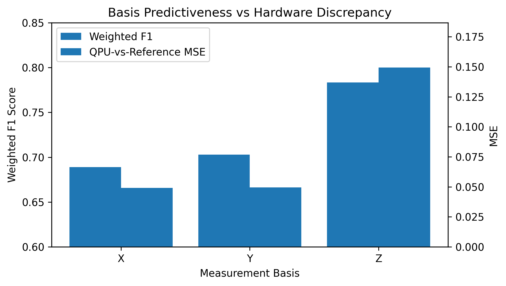
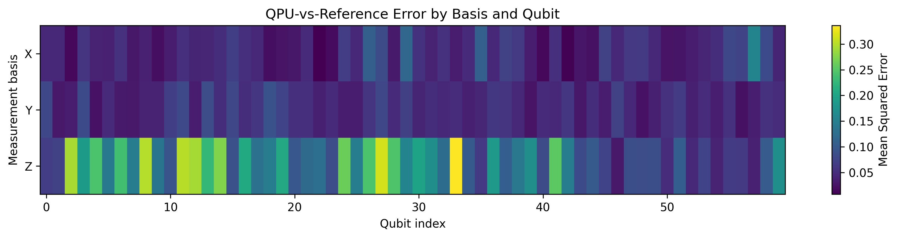
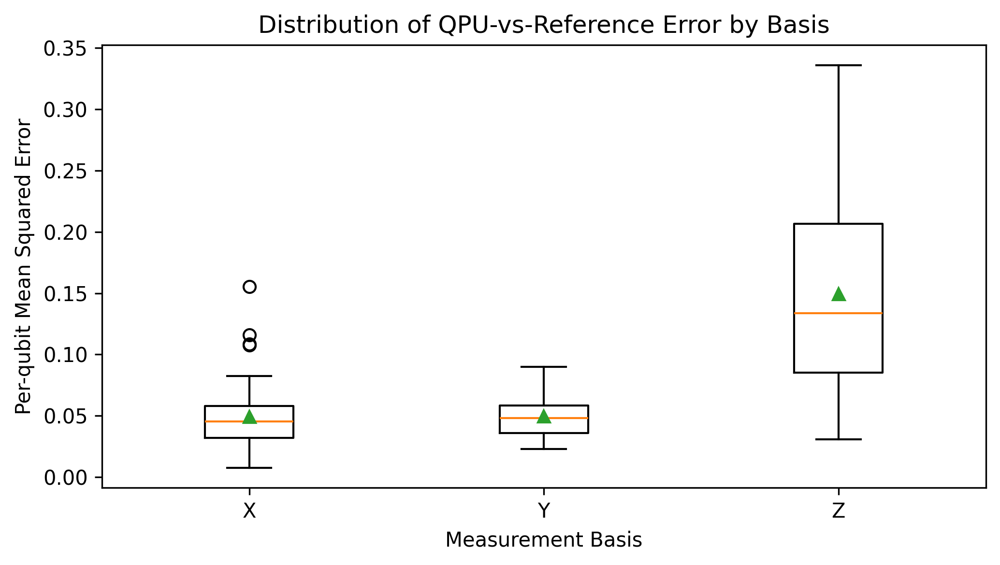
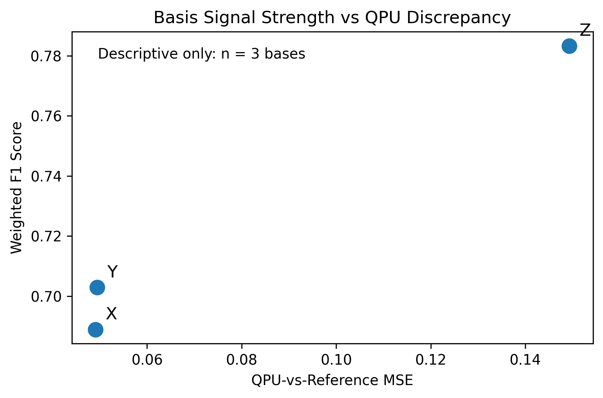

# Hardware Noise Resilience Across Quantum Measurement Bases for CAR-T Cytotoxicity Prediction

This project investigates whether different quantum measurement bases contribute differently to machine learning performance and hardware discrepancy in a sparse CAR-T cell cytotoxicity prediction task.

The project was developed for the UW-IBM Quantum Hackathon.

## Research Question

When does quantum data encoding actually help?

More specifically:

**Are some quantum measurement bases more predictive and more hardware-resilient than others?**

## Dataset and Task

The task is binary classification of CAR-T cell designs:

- Input: molecular design of a CAR-T construct
- Output: HIGH or LOW cytotoxicity
- Classical representation: 60-dimensional one-hot feature vector
- Quantum representation: 180-dimensional projected quantum feature vector
- Quantum features are split into:
  - X basis: 60 features
  - Y basis: 60 features
  - Z basis: 60 features

## Methods

We trained support vector machine classifiers on:

- Classical 60-dimensional features
- Full 180-dimensional quantum-projected features
- X-only quantum features
- Y-only quantum features
- Z-only quantum features

Then we selected 10 boundary samples from the classical SVM support vectors and ran their 60-qubit ZZFeatureMap circuits on IBM quantum hardware.

The QPU outputs were compared against precomputed reference projections for the same samples. We computed QPU-vs-reference discrepancy separately for the X, Y, and Z measurement bases.

## Key Results

### Predictive Performance

| Model | Features Used | Weighted F1 |
|---|---:|---:|
| Classical 60-dim | 60 | 0.7423 |
| Full Quantum 180-dim | 180 | 0.8108 |
| X-only Quantum | 60 | 0.6889 |
| Y-only Quantum | 60 | 0.7029 |
| Z-only Quantum | 60 | 0.7833 |

### QPU-vs-Reference Discrepancy

| Basis | MSE | MAE | Max Abs Error |
|---|---:|---:|---:|
| X | 0.049084 | 0.175002 | 0.691226 |
| Y | 0.049449 | 0.179455 | 0.697797 |
| Z | 0.149306 | 0.317581 | 1.169139 |

## Main Finding

The Z basis was the strongest individual predictive basis, but it also had the largest QPU-vs-reference discrepancy.

This means the simplest hypothesis — that the best basis is simply the least noisy basis — was not supported. Instead, the results suggest that the Z basis may carry stronger label-relevant signal, enough that it remains the most useful single basis despite higher hardware discrepancy.

## Figures

### Basis Predictiveness vs Hardware Discrepancy



### QPU-vs-Reference Error by Basis and Qubit



### Error Distribution by Basis



### Basis Signal Strength vs QPU Discrepancy



## Limitations

The reference projections used here are precomputed quantum projections for the same samples, not a true noiseless 60-qubit statevector simulation. Therefore, this experiment measures QPU-vs-reference discrepancy rather than pure ideal-vs-noisy hardware error.

The final basis-level signal-vs-discrepancy plot has only three basis-level points, so it should be interpreted descriptively rather than as a statistical correlation.

## IBM Quantum Setup

To run the QPU hardware section, you need your own IBM Quantum account and API key.

Do not paste your API key directly into this notebook before committing to GitHub.

Run this once locally in a private setup notebook or Python shell:

```python
from qiskit_ibm_runtime import QiskitRuntimeService

QiskitRuntimeService.save_account(
    channel="ibm_quantum_platform",
    token="YOUR_IBM_QUANTUM_API_KEY",
    overwrite=True
)

```

After that, the notebook can connect with:

```python
from qiskit_ibm_runtime import QiskitRuntimeService

service = QiskitRuntimeService()
```

## Project Structure

```text
.
├── README.md
├── notebooks/
│   └── Start_From_Here.ipynb
├── results/
│   ├── phase1_f1_scores.csv
│   ├── basis_noise_table.csv
│   ├── noise_vs_f1_table.csv
│   ├── error_distribution_by_basis.csv
│   ├── top_error_qubits_by_basis.csv
│   ├── projections_qpu_boundary_samples.csv
│   ├── projections_reference_boundary_samples.csv
│   └── qpu_experiment_outputs.npz
├── figures/
│   ├── basis_f1_vs_mse.png
│   ├── noise_heatmap_basis_qubit.png
│   ├── error_distribution_by_basis.png
│   └── basis_signal_vs_qpu_discrepancy.png
└── .gitignore
```

## Status

Completed exploratory QPU experiment with clearly stated limitations.
